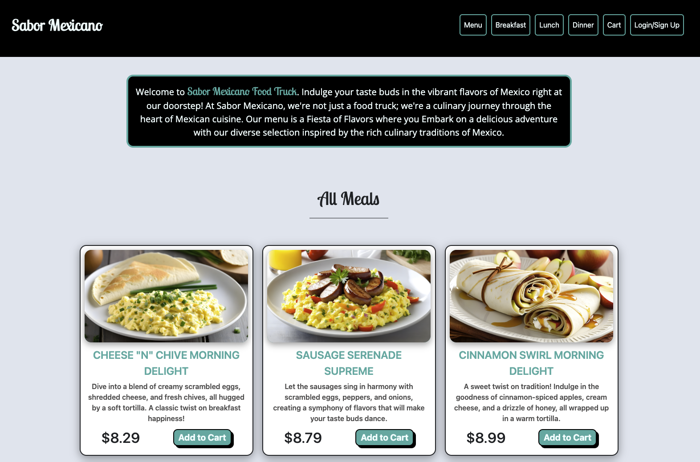

# Sabor Mexicano 

## Description
This full stack MERN application serves as a menu and ordering website for restaurants and food trucks. Our application specifically serves Sabor Mexicano, an Austin based, AI generated and designed food truck that serves authentic Mexican food. Our application follows the MERN stack, utilizing a MongoDB database, a GraphQL query layer, Express, React and Node. 


## Table of Contents

- [Installation](#installation)
- [Technologies Used](#technologies-used)
- [Example](#example)
- [Contributors](#contributors)
- [Deploy](#deploy)
- [License](#license)
- [Repository](#repository)

## Installation

```
npm install
npm run seed
npm run develop
```

## Technologies Used


## Example




## Contributors

* [Chase Ostien](https://github.com/ChaseOstien)
* [Richard Warden](https://github.com/r-warden)
* [Jake Howdeshell](https://github.com/JakeHowdeshell)
* [Kenny Zhang](https://github.com/KennyZhang12138)

## Deploy

Website: https://sabor-mexicano-aded3d6892cd.herokuapp.com/

## License

ISC License

https://opensource.org/licenses/ISC

## Repository

- GitHub: [Food-Menu](https://github.com/JakeHowdeshell/react-menu)